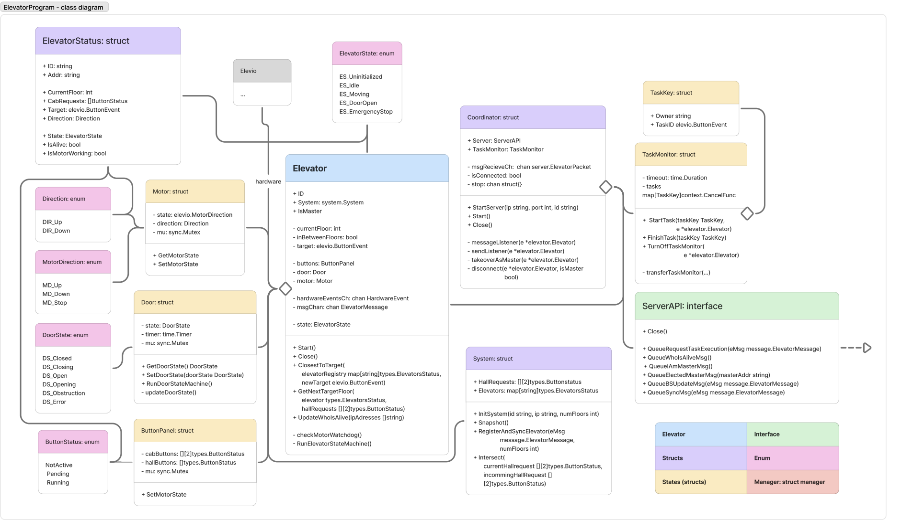

# Elevator Program

- [Elevator Program](#elevator-program)
  - [Overview](#overview)
  - [Run Elevator Simulation](#run-elevator-simulation)
    - [Default buttons](#default-buttons)
  - [Run the elevator at the lab](#run-the-elevator-at-the-lab)
  - [Running several elevators at the lab](#running-several-elevators-at-the-lab)
  - [Running multiple simulators](#running-multiple-simulators)


## Overview

[Download full PDF](images/class_diagram_elevator_program.pdf)


[Download full PDF](images/class_diagram_udp.pdf)


[Download full PDF](images/class_diagram_packet.pdf)


[Download full PDF](images/sequence_diagram_messageExchange.pdf)


[Download full PDF](images/sequence_diagram_whoIsAlive.pdf)

## Run Elevator Simulation

1. Start by opening the terminal and navigate to `../elevator_program`
2. Then run

```bash
chmod +x SimElevatorServer
```

3. Lastly run

```bash
./SimElevatorServer
```

and see the simulator appare.

Now, to run the program just open a new terminal window, navigate to `../elevator_program` and run
```bash
go run main.go
```

### Default buttons
Default keyboard controls

* Up: `qwertyui`
* Down: `sdfghjkl`
* Cab: `zxcvbnm`,.
* Stop: `p`
* Obstruction: `-`
* Motor manual override: Down: `7`, Stop: `8`, Up: `9`
* Move elevator back in bounds (away from the end stop switches): `0`

## Run the elevator at the lab

To make the elevator run at the lab:

1. Check if the everything is set up correctly
   - Turn _on_ the PC
   - Make sure everything is up to date
   - Toggle to `pc` and `obstruction` on the elevator panel
2. On the PC, open the terminal and go to `/elevator_program`
3. Run
   ```bash
   chmod +x elevatorserver
   ./elevatorserver
   ```
4. Open a new elevator, make sure you are in the correct folder (`/elevator_program`), and run
   ```bash
   go run main.go
   ```
5. Now the elevator should run

--- 
## Running several elevators at the lab


If you want to initialize/start other elevators from 1 PC, you need access to every PCs IP address. This you get 
by typing 
```bash 
hostname -I
```

Then you should do the following:

1. Make sure the project exists on each elevator PC (clone it once, then use git pull to update).
2. Now from you "master" PC, you want to ssh in to the other PCs and start the elevator server from there.
```bash
ssh student@<IP_Elevator1> "cd <PATH_TO_ELEVATOR_PROGRAM> && ./elevatorserver --port <PORT_ELevator1>"
ssh student@<IP_Elevator2> "cd <PATH_TO_ELEVATOR_PROGRAM> && ./elevatorserver --port <PORT_Elevator2>"
ssh student@<IP_Elevator3> "cd <PATH_TO_ELEVATOR_PROGRAM> && ./elevatorserver --port <PORT_Elevator3>"
```
3. Now, from your "master", open a new terminal run this:
```bash
cd <PATH_TO_ELEVATOR_PROGRAM>
go run . --addrs <IP_1>:<PORT_1>,<IP_2>:<PORT_2>,<IP_3>:<PORT_3>
```

It can look like this:
```bash
go run . --addrs 10.100.23.27:15657,10.100.23.31:15657,10.100.23.45:15657
```

After you have done this, it should open 3 terminals where every elevator runs!

---

## Running multiple simulators

If you want to test things locally by using the simulator, run this:

```bash
cd path/to/elevator_program
go run . --n 3 --baseport 15657 --ip localhost
```
